# In-Datacenter Performance Analysis of a Tensor Processing Unit
> [文章链接](https://ieeexplore.ieee.org/abstract/document/8192463)
## Introduction
TPU (Tensor Processing Unit) 2015年部署在 Google datacenter 的 custom ASIC, 目的是为了 accelerates the inference phase of neural networks, 在此之前 Google 在其datacenter主要是利用 CPU做inference，GPU做training，由于需求提升以及大规模部署CPU成本过于expensive，因此开发出ASIC对NNs进行accelerate。
### Benchmarks
Three kinds of NNs today：MLP，CNN，RNN，Table 1 shows two examples of each of the three types，represent **95%** of NN inference workload in Google datacenter。Written in TensorFlow。    
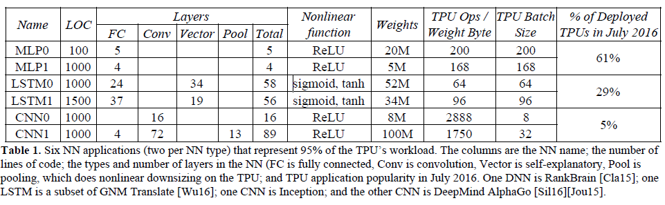    
### Benchmarked Servers
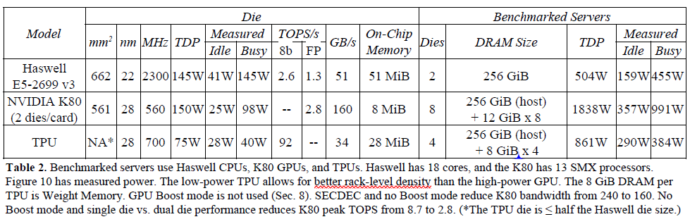      
Haswell processor：18 cores,2.3GHz without Turbo mode (seldom occur)    
Nvidia K80：without Boost mode (power and cooling problem,may force us to reduce the number of cards)    
## TPU Architecture
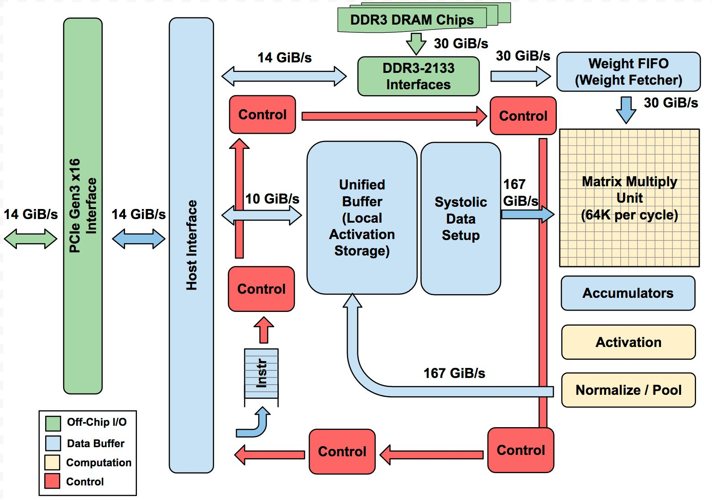     
* the Matrix Multiply Unit:256 * 256 MACs for 8-bit multiply-and-adds on signed or unsigned integers
* Accumulators: 4 MiB (4096,256-element,32-bit) 
* on-chip Weight FIFO:four tiles deep
* off-chip DRAM: 8 GiB
* on-chip Unified Buffer: 24 MiB ,use DMA controller get data from CPU Host memory   

fig2 show the the floor plan of the TPU die,the datapath is nearly two-thirds of the die,compare to CPU ,the control module is smaller.     
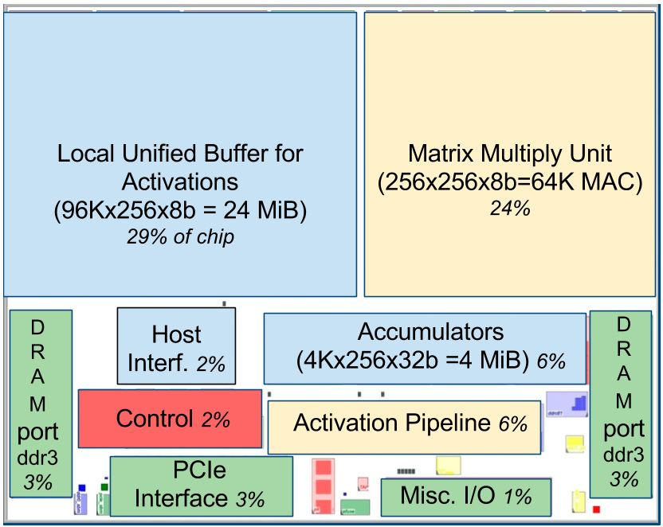     
### ISA:CISC tradition
1. To simplify hardware design and debugging, the host server sends TPU instructions for it to execute rather than fetching them itself.  
2. CPI:typically 10 to 20   
3. main five instructions:
* Read_Host_Memory
* Read_Weights
* MatrixMultiply/Convolve
* Activate:performs the nonlinear function of the artificial neuron and the pooling operations
* Write_Host_Memory    
4. 4-stage pipeline, plan to hide the execution of the other instructions by overlapping their execution with the MatrixMultiply instruction. Not have clean pipeline overlap diagram because it can occupy a station for thousands of clock cycles.
### systolic execution
Balance I/O and computing operation,can improve thoughput when small bandwith    
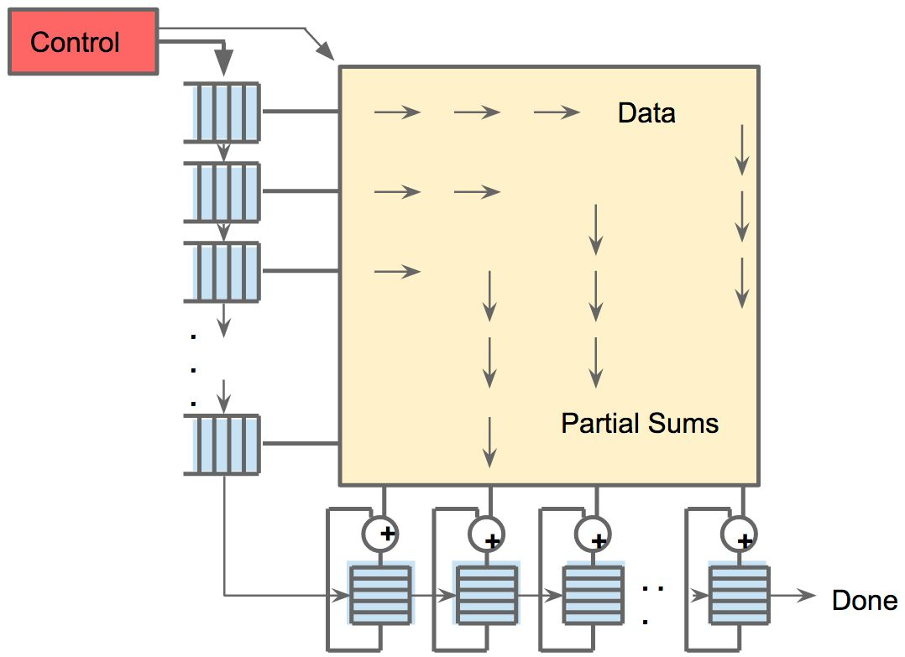     
Martrix Cell:     
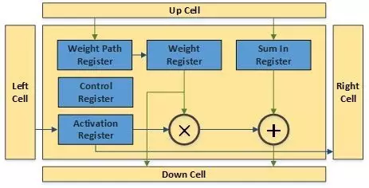     
[link ](https://cloud.google.com/blog/products/ai-machine-learning/what-makes-tpus-fine-tuned-for-deep-learning)     
### software stack
had to be compatible with those developed for CPUs and GPUs so that applications could be ported quickly to the TPU.    
* User Space Driver: sets up and controls TPU execution, reformats data into TPU order, translates API calls into TPU instructions, and turns them into an application binary
* Kernel Driver: memory management and interrupts
## Performance
### Roofline model
Offers insights on toperations per DRAM byte accessedhe causes of performance bottlenecks.
* X-axis:operations per memory byte accessed
* Y-axis:floating-point operations per second     
### Result of roofline model
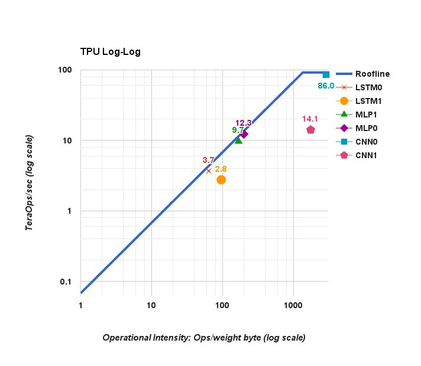   
CNN1: less than half of its cycles performing matrix operations
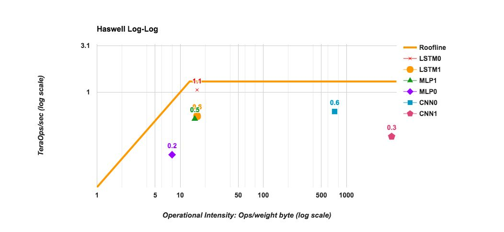    
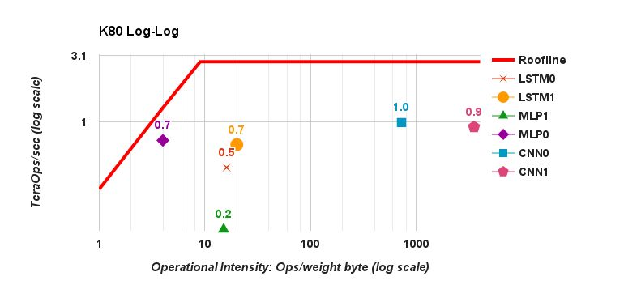     
For CPU and GPU,response time is the reason.Inference perfers latency over thoughput,there have 7ms limitation.    
table6 gives the bottom line of relative inference performance per die including the host server overhead for the two accelerators versus the CPU.       
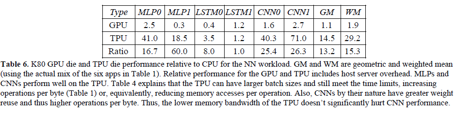     
### Performance/Watt
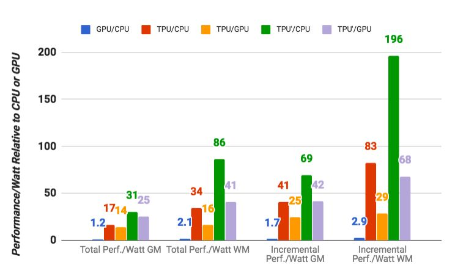   
TPU':hypothetical TPU die,GDDR5 memory,700MHz,reducing the Unified Buffer to 14 MiB    
## Conclusion
Despite low utilization for some applications, the TPU is on average about 15X-30X faster than its contemporary GPU or CPU, with TOPS/Watt about 30X - 80X higher. Moreover, using the GPU’s GDDR5 memory in the TPU would triple achieved TOPS and raise TOPS/Watt to nearly 70X the GPU and 200X the CPU.
## Question
1. why double buffering,so can 2048*2=4096?
2. the Read_Weights instruction follows the decoupled-access/execute philosophy,in that it can complete after sending its address but before theweight is fetched from Weight Memory?
