# Optimizing FPGA-based convolutional neural networks accelerator for image super-resolution
>[文章链接](https://dl.acm.org/citation.cfm?id=3201695)   
## Introduction   
Super-resolution 图像处理的经典问题，对输入的 low-resolution(LR) 进行处理，输出为 high-resolution(HR)。Fast super-resolution CNN (FSRCNN) 为其中一种算法，由多个卷积层和一个反卷积层构成。其中在卷积层 input block 与 kernel 进行卷积操作而downscale,而在反卷积层the input pixels upscale，输入为low-resolution (LR) input feature maps 而输出为 high-resolution (HR) output feature maps。   
其中，反卷积层在硬件实现上主要有两个问题：
1. 反卷积层不仅需要当前output feature map，还需要load之前获得的output feature map，并存在memory中，即overlappiing sum problem。
2. 为了解决overlappiing sum problem需要在反卷积层进行MAC（乘累加）运算，提高计算load且随output resolution增大而增大。   

## Background
### FSRCNN
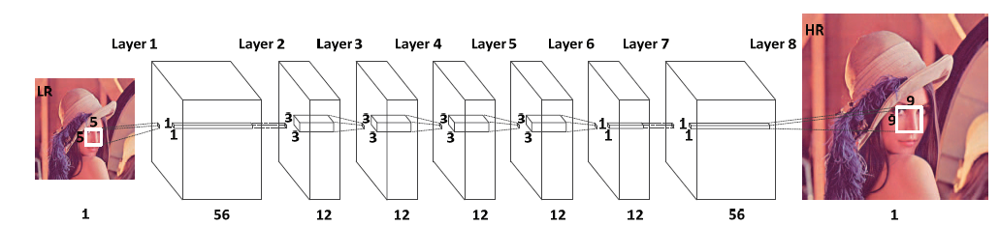   
fig1 即FSRCNN的结构，共八层，第一层feature extraction通过56个5 * 5 resolution的kernel将LR输出56个feature map，最后一层将一系列卷积操作生成的56个1 * 1 resolution的kernel进行反卷积生成HR image。Table1 为各层情况。
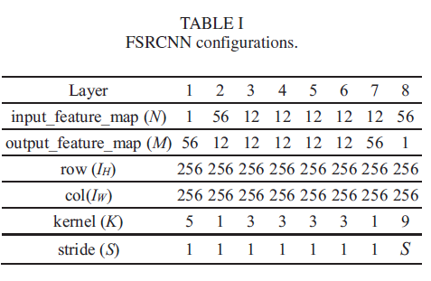
### Hardware Implementation
FSRCNN的硬件实现有以下方法：
* **Intra convolutional layer parallelism**：fig3 为卷积层计算的伪代码，层内并行主要有loop pipelining,loop tiling,and loop unrolling。   
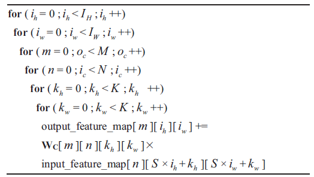
* **Intra deconvolutional layer parallelism**：可采用《[Optimizing FPGA-based Accelerator Design for Deep Convolutional Neural Networks](https://dl.acm.org/citation.cfm?id=2689060)》中的 tiling technique，伪代码如fig4所示。   
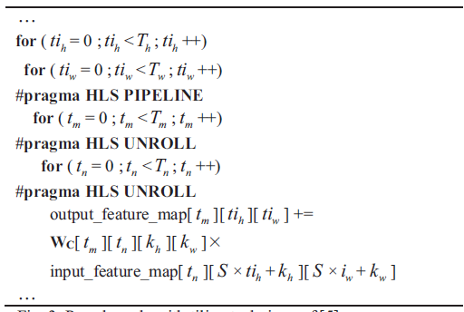   
* **Inter convolutional layer parallelism**：由于层间存在dependency因此parallel problem，但multi-CLP可以解决。    
### Baseline
>[DCNN](https://arxiv.org/abs/1705.02583)   
* 提出reverse looping method，通过理想输出决定输入，但loop dimension increase 随 HR image变大。 
* 为使计算有效并行提出tiling technique，同时基于roofline model设计convolutional layer processor(CLP)，但各layer的feature map不同使用single-CLP会使resource underutilization。   
## Architecture 
### TDC method
TDC即将反卷积层转化为卷积层，方法步骤如下：
1. 推出能使输出pixel相邻blocks之间没有overlap的input block size KC,公式如下：   
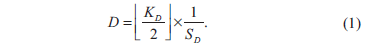    
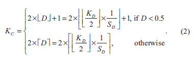    
在FSRDNN中，KD是反卷积的输入size，一般设置为9，步长SD根据output feature map size设置为2/3/4，则根据公式(2)KC得出一般为3或5。
2. 计算转化后卷积层的weights，设置输入输出pixel的坐标以及反卷积层中的权重xd，范围如下：    
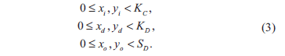    
存在以下equations：    
   
可得转化后卷积层的权重WC，   
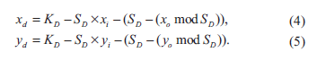    
至此，转化成卷积层所需要的参数均已获得，且与Baseline相比，因为SD、KD、WD已知，则不需要在每次循环迭代的过程中计算KC、WC。In addition，对于same input block可generate SD * SD pixel resolution的output blocks，这是开发parallelism的source。Table2 为采用TDC之后的各层的情况。    
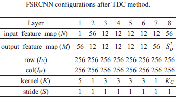    
### Multi-CLP
采用single-CLP对所有层进行process会导致资源的浪费，若根据layer的输入输出feature map 采用相应的CLP，即multi-CLP，会使execution cycles有明显的下降。fig5是给出的一个example，包括三种CLP，第1、7层由于输出feature map 大于输入，采用一种类型CLP，第3、4、5、6输入输出相同为一种CLP，第2、8层输入大于输出。由于第8层的process主要是out of order，因此需要大量资源，因此优化的方法主要是在reduce其他CLPs的resources而提高8th layer。    
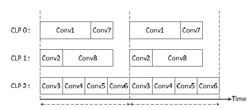      
fig6为优化前后cycles的comparsion:    
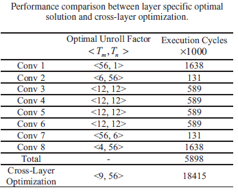     
## Experimental results
### Setup
* FPGA：Xilinx Virtex-7 485T
* Vivado HLS 2016.4
* single-precision floating point
### Performance
#### After using TDC method   
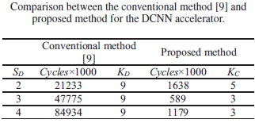    
fig7 为采用TDC后取不同block size时的execution cycles变化，结果显示the proposed method had a **throughput** up to **81 times** higher than the conventional method. 分析原因如下：
1. 采用TDC后kernel size reduce;
2. output feature maps increased from 1 to SD * SD，DSP underutilization problem被解决。   
#### After using multi-CLP
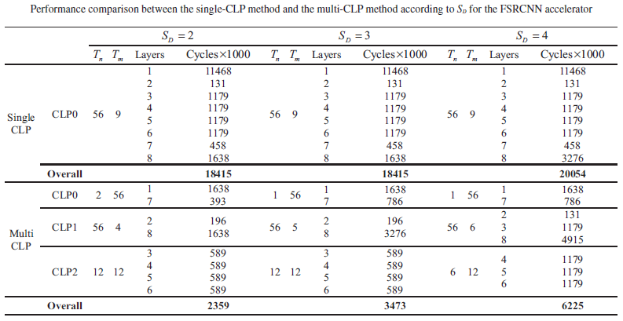     
此处将CLPs设为3，如之前example中配置，结果显示performance of the multi-CLP method was up to **7.8 times** faster than the single-CLP method。
