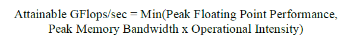
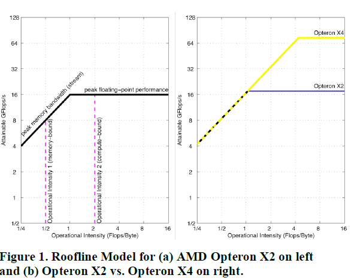
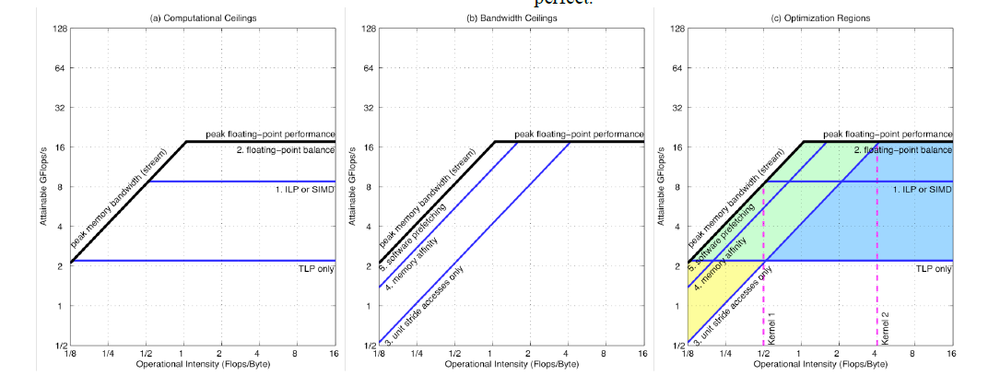

# Roofline: An Insightful Visual Performance Model for Floating-Point Programs and Multicore Architectures
> [paper_link](https://parlab.eecs.berkeley.edu/sites/all/parlab/files/EECS-2008-134.pdf)
## Motivation
Off-chip memory bandwidth will often be the constraining resource, need a model that relates processor performance to off-chip memory traffic.
## The Roofline Model
* Operational intensity: operations per byte of DRAM traffic         
X-axis (GFlops/byte)
* Floating-point performance: formula1     
Y-axis (GFlops/second)
* memory performance: (byte/second)     

Fig1 is one of examples:    
    

1. horizontal line: hardware limit , suggests peak floating-point performance of the computer.
2. slanted line: the memory system of that computer can support for a given operational intensity.
3. ridge point: The x-coordinate of the ridge point is the minimum operational intensity required to achieve maximum performance, suggest the level of difficulty.
## Ceilings
For the optimizations to perform, performing the associated optimization can break through the ceiling.     
     
1. The operational intensity determines the optimization region, and thus which optimizations to try.
2. The order of the ceilings suggest the optimization order.
## How we get the parameters?
* Operational density: to use performance counters to measure the actual number of operations and to measure the actual amount of memory traffic.
* Memory Bandwidth: a series of highly tuned versions of the STREAM benchmark that perform both a dot product and a copy.
* Floating-point performance: using the hardware specifications or microbenchmarks
